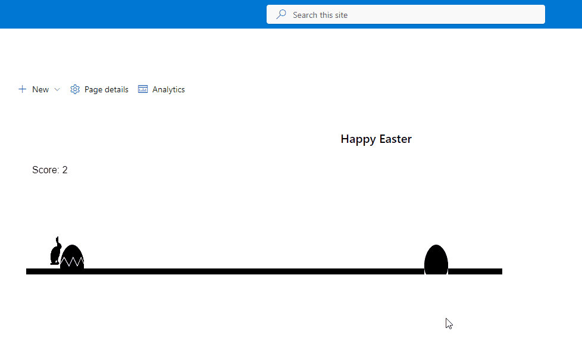

# eggcellent-runner 🐰🥚🏃

This SharePoint SPFx web part features a fun and engaging Easter-themed game called Eggcellence Runner. Players help an Easter rabbit avoid obstacles and collect Easter eggs to gain points.

# image

## Features 🌟

- A fast-paced and addictive side-scrolling runner game
- Charming Easter rabbit character
- Gradually increasing difficulty
- Score tracking and collision detection
- Customizable obstacle images
- Developed using TypeScript, React, and Fluent UI React

## How to Play 🎮

1. Deploy the Eggcellence Runner web part to your SharePoint site.
2. Add the web part to a SharePoint page.
3. Press the spacebar to make the rabbit jump and avoid obstacles.
4. Earn points by successfully avoiding obstacles.
5. The game will stop after three collisions with obstacles.

Enjoy the game and have a fantastic Easter celebration! 🐰🥚🌷

## Used SharePoint Framework Version

## Applies to

- [SharePoint Framework](https://aka.ms/spfx)
- [Microsoft 365 tenant](https://docs.microsoft.com/en-us/sharepoint/dev/spfx/set-up-your-developer-tenant)

> Get your own free development tenant by subscribing to [Microsoft 365 developer program](http://aka.ms/o365devprogram)

## Prerequisites

> Any special pre-requisites?

## Solution

| Solution    | Author(s)                                               |
| ----------- | ------------------------------------------------------- |
| root | Valeras Narbutas |

## Version history

| Version | Date             | Comments        |
| ------- | ---------------- | --------------- |
| 0.1    | April 07, 2023   | Initial release |

## Disclaimer

**THIS CODE IS PROVIDED _AS IS_ WITHOUT WARRANTY OF ANY KIND, EITHER EXPRESS OR IMPLIED, INCLUDING ANY IMPLIED WARRANTIES OF FITNESS FOR A PARTICULAR PURPOSE, MERCHANTABILITY, OR NON-INFRINGEMENT.**

---

## Minimal Path to Awesome

- Clone this repository
- Ensure that you are at the solution folder
- in the command-line run:
  - **npm install**
  - **gulp serve**

> Include any additional steps as needed.

## References

- [Getting started with SharePoint Framework](https://docs.microsoft.com/en-us/sharepoint/dev/spfx/set-up-your-developer-tenant)
- [Building for Microsoft teams](https://docs.microsoft.com/en-us/sharepoint/dev/spfx/build-for-teams-overview)
- [Use Microsoft Graph in your solution](https://docs.microsoft.com/en-us/sharepoint/dev/spfx/web-parts/get-started/using-microsoft-graph-apis)
- [Publish SharePoint Framework applications to the Marketplace](https://docs.microsoft.com/en-us/sharepoint/dev/spfx/publish-to-marketplace-overview)
- [Microsoft 365 Patterns and Practices](https://aka.ms/m365pnp) - Guidance, tooling, samples and open-source controls for your Microsoft 365 development
